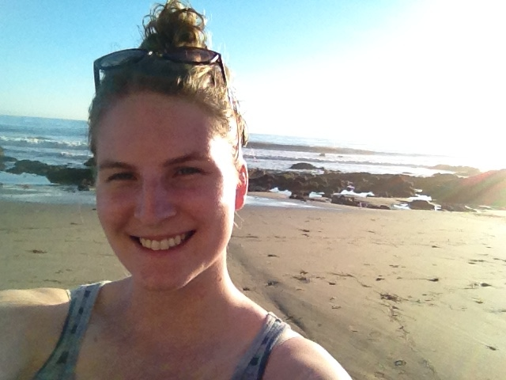

### Computational Biology: Spring 2017

### About Me:
##### I am an aspiring marine biologist and second year PhD student in Dr. Melissa Pespeni's lab at the University of Vermont. [Link to my UVM webpage](http://www.uvm.edu/~biology/?Page=students/makukhov.php&SM=facultysubmenu.html)  

Me in California during Fall 2016 field collections of the purple sea urchin, *Strongylocentrotus purpuratus*.

## Homeworks:

* Assignment 1: Links and fun fact emailed to Nick     
* [Assignment 2](Homework02.html)

## Notes:

#####Lecture
* [January 17, 2017: Intro Notes & GitHub Lingo]()

#####Lab   
* [January 18, 2017: Intro to GitHub, RMarkdown, and Making Homepage]()   
